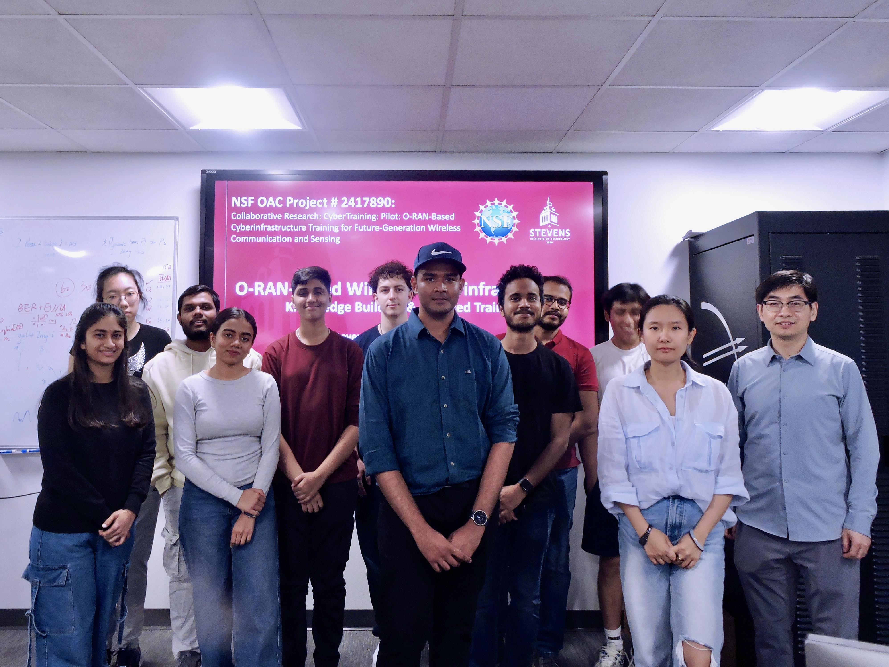

This is a one-month intensive wireless training project designed for Master's students interested in next-generation wireless communication. The program offers hands-on exposure to key technologies including mmWave systems, Integrated Sensing and Communication (ISAC), and Open Radio Access Networks (O-RAN). It is ideal for students looking to build foundational understanding and practical experience in cutting-edge wireless systems.

## 📸 Project Highlights

### Team Photo  

  
  
▲ Our research group working on O-RAN-based ISAC and mmWave sensing (Summer 2025)

### Experiment in Progress  

  
  
▲ Real-time demo of mmWave-based passive sensing with O-RAN platform

